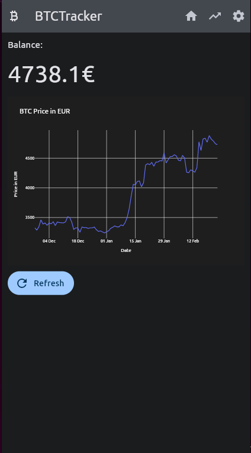
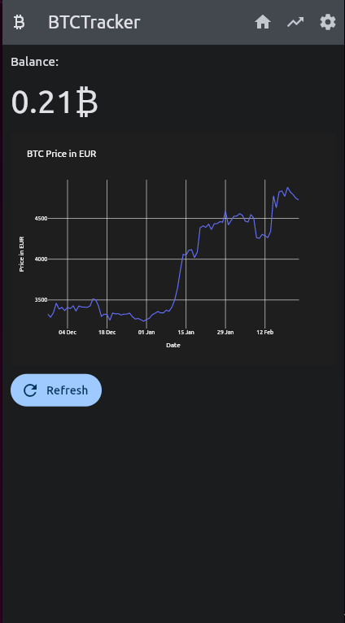
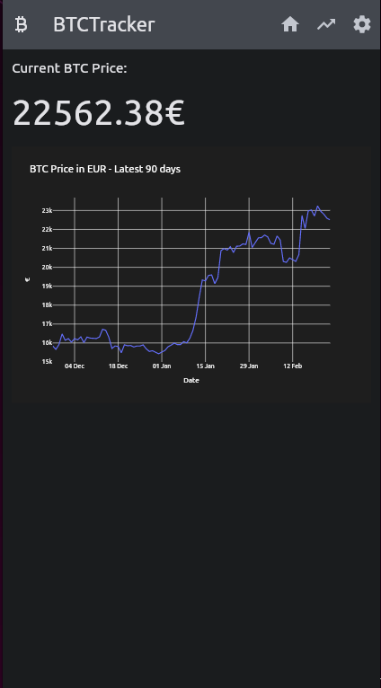
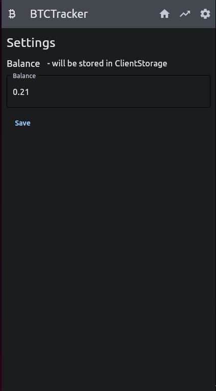

# BTCTracker Flet Application

BTCTracker Flet Application is a Python-based simple Bitcoin price tracker. It allows users to track the price of Bitcoin in Euros and Bitcoin, and displays this information on a graph that is optimized for smartphone devices. This release is optimized for smartphones.

Demo (use your smartphone): https://btc-tracker.fly.dev/

## Features

- Real-time Bitcoin price tracker
- PWA (Progressive Web App) support for all devices
- Mobile-optimized graph
- No user data storage
- Easy to host on any server that supports Python
- Build for Windows, MacOs, and Linux


## Screenshots











## Installation

To run BTCTracker Flet Application, follow these steps:

1. Clone the repository to your local machine
2. Install the necessary dependencies using the following command: 


```
pip install -r requirements.txt


python3 App.py

```

The application runs on port 3333 by default, but you can modify the code to use any available port.

## Usage

Once you have installed and started the application, you can access it via a web browser at http://localhost:3333. The home page displays the Bitcoin price tracker, which shows the price of Bitcoin in Euros and Bitcoin. The Balance can be viewed in either Euro Bitcoin / Sats mode.

The application does not store any user data and uses client storage instead.

## Build

BTCTracker Flet Application can be built for Windows, MacOS, and Linux. To build the application, please refer to the instructions provided on [flet.dev](https://flet.dev).

## Contact

If you require a Flet application developer, please contact [Mario Santella](https://www.mariosantella.com).